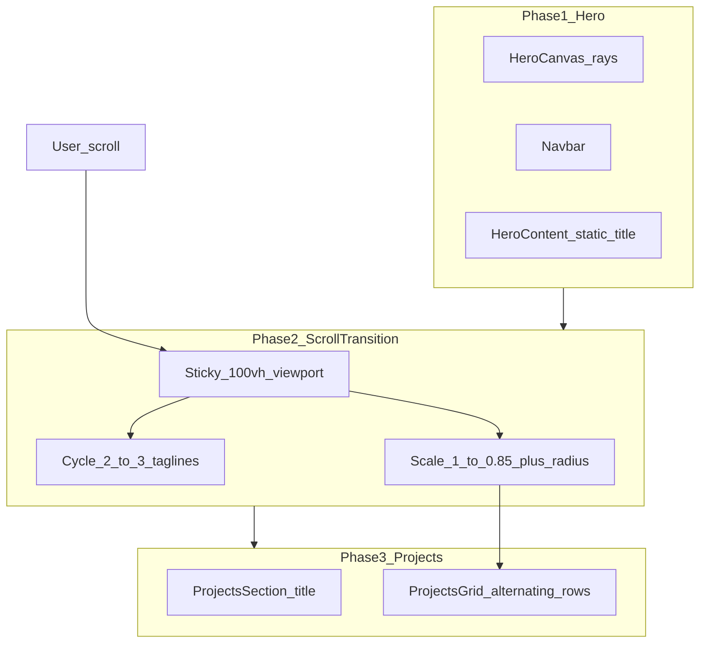

# Personal Portfolio — React Implementation Plan

Target location: [`/Users/jadensimmons/Coding/web-files/cursor-demo`](/Users/jadensimmons/Coding/web-files/cursor-demo)

Source references:
- [`Portfolio Hero.dc.html`](/Users/jadensimmons/Coding/web-files/new-personal-portfolio/Portfolio%20dashboard%20mockup/Portfolio%20Hero.dc.html) — full-viewport hero, canvas background, navbar, centerpiece copy, scroll cue
- [`Works.dc.html`](/Users/jadensimmons/Coding/web-files/new-personal-portfolio/Portfolio%20dashboard%20mockup/Works.dc.html) — projects index header + 4 alternating 2-column rows
- [`support.js`](/Users/jadensimmons/Coding/web-files/new-personal-portfolio/Portfolio%20dashboard%20mockup/support.js) — canvas ray animation logic embedded in Hero script block (lines 64–165 of Hero HTML)

---

## 1. Recommended Folder Architecture

```text
cursor-demo/
├── index.html
├── package.json
├── vite.config.js
├── tailwind.config.js
├── postcss.config.js
├── PLAN.md                          # this plan (written on execution)
├── public/
│   └── favicon.svg
└── src/
    ├── main.jsx
    ├── App.jsx
    ├── index.css                    # Tailwind directives + @font-face imports
    ├── data/
    │   └── projectsData.js          # 4 projects from Works.dc.html
    ├── lib/
    │   └── scrollConfig.js          # scroll ranges, taglines, scale targets
    ├── hooks/
    │   └── useAtmosphericCanvas.js  # ported from Hero canvas logic
    └── components/
        ├── layout/
        │   └── Navbar.jsx           # shared pill nav (hero + projects)
        ├── hero/
        │   ├── HeroSection.jsx      # pinned scroll container orchestrator
        │   ├── HeroCanvas.jsx       # canvas + vignette overlay
        │   ├── HeroContent.jsx      # eyebrow, title, cycling taglines
        │   └── ScrollCue.jsx        # "EXPLORE // SCROLL DOWN" + arrow
        └── projects/
            ├── ProjectsSection.jsx  # white section + index header
            ├── ProjectsGrid.jsx     # maps projectsData → rows
            ├── ProjectCard.jsx      # text column (meta, title, subtitle, body, CTA)
            └── ProjectMedia.jsx     # 4:3 gradient placeholder visual
```

**Why Vite:** Single-page scroll choreography (pinning + `useScroll`) is simpler without Next.js routing/SSR overhead. Static deploy-friendly.

---

## 2. Package Dependencies

**Scaffold + core:**
```bash
npm create vite@latest . -- --template react
npm install
```

**Styling + animation + icons:**
```bash
npm install -D tailwindcss postcss autoprefixer
npx tailwindcss init -p
npm install framer-motion lucide-react
```

| Package | Role |
|---------|------|
| `vite`, `@vitejs/plugin-react` | Dev server + JSX build |
| `tailwindcss` | Utility classes mapped from Claude inline styles |
| `framer-motion` | `useScroll`, `useTransform`, `motion`, `AnimatePresence` for hero pin/scale/tagline cycle |
| `lucide-react` | Scroll arrow (`ChevronDown` / `Mouse` icon) and optional nav/CTA icons |

No router needed — one [`App.jsx`](src/App.jsx) composes Hero + Projects.

---

## 3. Extracting CSS / Color Tokens into Tailwind

The Claude exports use **inline styles**, not CSS variables. Extract recurring values into [`tailwind.config.js`](tailwind.config.js) `theme.extend`:

### Colors (from both exports)

| Token | Source value | Tailwind key suggestion |
|-------|--------------|-------------------------|
| Hero bg | `#02060f` | `ink.950` |
| Canvas mid | `#0c2247`, `#06142e` | `ink.800`, `ink.900` |
| Hero headline | `#f4f8ff` | `mist.50` |
| Hero body | `rgba(210,225,250,.82)` | `mist.200/82` |
| Nav pill bg | `rgba(9,18,38,.32)` | custom `nav-glass` via `@layer utilities` |
| Nav border | `rgba(150,190,255,.14)` | `sky.200/14` |
| Accent blue (Works) | `#2b5fd0` | `brand.600` |
| Projects bg | `#ffffff` | `white` |
| Projects text | `#0a0a0a` | `neutral.950` |
| Muted body | `rgba(0,0,0,.6)` | `neutral-950/60` |
| Status dot | `#7fd0ff` | `cyan.300` |
| Card border | `rgba(140,180,255,.16)` | `sky.200/16` |

### Typography

From `<helmet>` font links in both HTML files:

```js
fontFamily: {
  sans: ['Sora', 'system-ui', 'sans-serif'],
  serif: ['"Cormorant Garamond"', 'serif'],
  mono: ['"Space Mono"', 'monospace'],
}
```

Add Google Fonts in [`index.html`](index.html) (same URL as exports).

### Letter-spacing utilities

Claude uses tight tracking on headlines and wide tracking on labels:

```js
letterSpacing: {
  label: '0.16em',      // nav brand
  labelWide: '0.42em',  // hero eyebrow
  nav: '0.22em',        // nav links
}
```

### Font sizes (match `clamp` behavior)

Use Tailwind arbitrary values or extend:

```js
fontSize: {
  'hero-title': ['clamp(38px,6.4vw,104px)', { lineHeight: '0.98', letterSpacing: '-0.015em' }],
  'projects-title': ['clamp(44px,6.6vw,96px)', { lineHeight: '0.98' }],
  'project-heading': ['clamp(30px,3.4vw,48px)', { lineHeight: '1.02' }],
}
```

### Custom utilities in [`src/index.css`](src/index.css)

Port keyframes from Hero HTML:

```css
@keyframes float-arrow { /* lines 17 of Hero */ }
@keyframes reveal-up { /* lines 18 of Hero */ }

@layer utilities {
  .nav-glass {
    @apply rounded-full border border-sky-200/15 bg-[rgba(9,18,38,0.32)]
           backdrop-blur-[14px] shadow-[0_8px_40px_rgba(0,0,0,0.35)];
  }
  .hero-vignette {
    background: radial-gradient(120% 90% at 50% 52%,
      rgba(2,6,15,0) 42%, rgba(2,6,15,.55) 82%, rgba(2,6,15,.9) 100%);
  }
}
```

### Project card gradients

Encode per-project `mediaGradient` strings in `projectsData.js` (copied from Works rows 55–103) rather than hardcoding in JSX.

---

## 4. Scroll Architecture (Apple-Style Transition)



### DOM structure in [`HeroSection.jsx`](src/components/hero/HeroSection.jsx)

```jsx
<section ref={containerRef} className="relative h-[300vh]"> {/* scroll distance */}
  <div className="sticky top-0 h-screen overflow-hidden">
    <motion.div style={{ scale, borderRadius }} className="relative h-full origin-center">
      <HeroCanvas />
      <div className="hero-vignette absolute inset-0" />
      <Navbar variant="hero" />
      <HeroContent activeTagline={taglineIndex} />
      <ScrollCue opacity={scrollCueOpacity} />
    </motion.div>
  </div>
</section>
<ProjectsSection />
```

### Framer Motion bindings

In [`scrollConfig.js`](src/lib/scrollConfig.js):

```js
export const TAGLINES = [
  'Explore the selected portfolio of visual artist Elena Petrova — light, motion, and memory.',
  'Wayfinding, motion identity, and spatial narratives across print and screen.',
  'Selected works from 2019–2026 — strategy, exhibition, and generative light.',
];

export const SCROLL = {
  taglineStart: 0.05,
  taglineEnd: 0.55,   // divide range into 3 segments for index 0/1/2
  scaleStart: 0.35,
  scaleEnd: 0.95,
  scaleFrom: 1,
  scaleTo: 0.85,
  radiusTo: 24,       // px — matches card radius language
};
```

In `HeroSection`:

- `const { scrollYProgress } = useScroll({ target: containerRef, offset: ['start start', 'end end'] })`
- `scale = useTransform(scrollYProgress, [0.35, 0.95], [1, 0.85])`
- `borderRadius = useTransform(scrollYProgress, [0.35, 0.95], [0, 24])`
- `taglineIndex = useTransform(scrollYProgress, ...)` → drive `AnimatePresence` crossfade in `HeroContent`
- Fade out `ScrollCue` after ~10% scroll progress

**Accessibility:** Wrap scroll-driven transforms in `useReducedMotion()` — skip pin/scale, show final tagline, allow normal document scroll.

---

## 5. Component Implementation Order

### Step 1 — Scaffold + Tailwind + fonts
- Init Vite React app in `cursor-demo`
- Configure Tailwind `content: ['./index.html', './src/**/*.{js,jsx}']`
- Add fonts + base `body { @apply bg-ink-950 font-sans antialiased; }`
- Verify dev server runs

### Step 2 — Design tokens + `projectsData.js`
Create [`src/data/projectsData.js`](src/data/projectsData.js) with 4 entries mirroring Works.dc.html:

| Field | Example (Project 01) |
|-------|---------------------|
| `id` | `'01'` |
| `index` | `1` |
| `category` | `'STRATEGY // IDENTITY'` |
| `title` | `'Re-imagining Urban Mobility.'` |
| `titleItalic` | optional Garamond span |
| `subtitle` | `'A brand system for a 12-line transit network'` |
| `description` | paragraph text |
| `href` | `'#'` |
| `mediaLabel` | `'PROJECT 01 · 24 STILLS'` |
| `mediaPlaceholder` | `'[ IDENTITY SYSTEM · 4:3 ]'` |
| `mediaGradient` | CSS gradient string from export |
| `layout` | `'text-left'` or `'text-right'` (alternating) |

### Step 3 — `Navbar.jsx`
- 3-column grid: brand (`ELENA PETROVA // EST. 1991`) | links | status pill
- Props: `variant: 'hero' | 'projects'` — same glass pill in both exports; projects variant uses `position: relative` wrapper instead of absolute
- Links: WORK, ABOUT, ESSAYS, CONNECT (anchor `#projects`, `#about`, etc. for future sections)
- Status: cyan dot + `AVAILABLE '26` (Lucide optional; dot is a styled `<span>`)

### Step 4 — `useAtmosphericCanvas.js` + `HeroCanvas.jsx`
Port logic from Hero script (lines 69–164):

- 300 rays, `globalCompositeOperation: 'lighter'`, radial bg gradient, bloom pulse
- `ResizeObserver` + `devicePixelRatio` capped at 2
- Cleanup: `cancelAnimationFrame` + disconnect observer on unmount
- Expose as hook returning `canvasRef`

`HeroCanvas.jsx`: full-bleed `<canvas ref={canvasRef} className="absolute inset-0 h-full w-full" />`

### Step 5 — `HeroContent.jsx` + `ScrollCue.jsx`
- Static H1 from export: "The Art of the **Abstract Narrative.**" (italic Garamond span)
- Eyebrow: `SELECTED WORKS — VOL. IV`
- Tagline area: `AnimatePresence mode="wait"` cycling 3 strings from `TAGLINES` based on scroll segment
- Initial mount: apply `reveal-up` animation (CSS) matching export stagger delays
- `ScrollCue`: mono label + Lucide `ChevronDown` or inline SVG from export with `float-arrow` animation

### Step 6 — `HeroSection.jsx` (scroll orchestration)
- Tall wrapper (`h-[250vh]`–`h-[300vh]`) for scroll runway
- Sticky inner viewport
- Wire `useScroll` / `useTransform` for scale, radius, tagline index, scroll cue opacity
- Background behind scaled hero transitions to white as projects emerge (optional: `useTransform` on section bg color)

### Step 7 — `ProjectMedia.jsx`, `ProjectCard.jsx`, `ProjectsGrid.jsx`
- **`ProjectMedia`**: `aspect-[4/3]`, `rounded-2xl`, `overflow-hidden`, layered gradients + diagonal stripe overlay (from Works inline styles)
- **`ProjectCard`**: mono category line, H2 with optional italic span, subtitle, body, CTA link styled as export (`border-b border-brand-600/35`)
- **`ProjectsGrid`**: `max-w-[1200px]`, `gap-[130px]` between rows; each row is `grid grid-cols-1 lg:grid-cols-2 gap-[78px]` with order flip when `layout === 'text-right'`

### Step 8 — `ProjectsSection.jsx`
- White background section with relative nav (from Works)
- Index header block: `PROJECT INDEX — 2019 · 2026` + "Selected *Works.*" title
- Renders `<ProjectsGrid projects={projectsData} />`
- Bottom spacer `h-24`

### Step 9 — `App.jsx` assembly
```jsx
<>
  <HeroSection />
  <ProjectsSection id="projects" />
</>
```
- Ensure scaled hero visually "reveals" white projects section beneath (z-index: hero sticky layer above until scale completes)

### Step 10 — Responsive + polish
- Mobile: single-column project rows (image always above or below text consistently)
- Nav: collapse center links to icon menu below `md` breakpoint (optional stretch goal)
- `prefers-reduced-motion`: disable canvas animation + scroll transforms
- Performance: pause canvas RAF when hero scroll section leaves viewport (`IntersectionObserver`)

---

## 6. Key Translation Notes (Claude → React)

| Claude export | React equivalent |
|---------------|------------------|
| Inline `style="..."` on every element | Tailwind utilities + few custom classes |
| `<canvas ref="{{ canvasRef }}">` + DCLogic class | `useAtmosphericCanvas` hook |
| Separate Hero + Works HTML files | Single page; Works content becomes `ProjectsSection` revealed after scroll |
| Static hero paragraph | Becomes 1 of 3 scroll-cycled taglines + static H1 |
| Placeholder project visuals | `ProjectMedia` component until real assets added |
| `support.js` runtime | **Not ported** — only the Hero canvas draw loop is reused |

---

## 7. Suggested `tailwind.config.js` excerpt

```js
/** @type {import('tailwindcss').Config} */
export default {
  content: ['./index.html', './src/**/*.{js,jsx}'],
  theme: {
    extend: {
      colors: {
        ink: { 800: '#0c2247', 900: '#06142e', 950: '#02060f' },
        mist: { 50: '#f4f8ff', 200: '#d2e1fa' },
        brand: { 600: '#2b5fd0' },
      },
      fontFamily: {
        sans: ['Sora', 'system-ui', 'sans-serif'],
        serif: ['"Cormorant Garamond"', 'serif'],
        mono: ['"Space Mono"', 'monospace'],
      },
      maxWidth: { nav: '1180px', projects: '1200px' },
    },
  },
  plugins: [],
};
```

---

## 8. Verification Checklist

- Hero canvas matches export: radial blue glow, rotating light rays, center bloom
- Navbar glass pill matches blur, border, and 3-column layout
- Scroll pins hero for full transition range; no layout jump on refresh
- 3 taglines crossfade at distinct scroll segments
- Hero scales from 1.0 → 0.85 with increasing border-radius; projects visible underneath
- 4 project rows alternate text/image sides on desktop
- All copy sourced from `projectsData.js`, not hardcoded in JSX
- Reduced-motion path works without pinned scroll

---

## 9. Execution Deliverable

On approval, the first file written will be **`PLAN.md`** at the repo root (this document), then implementation proceeds in the step order above.
